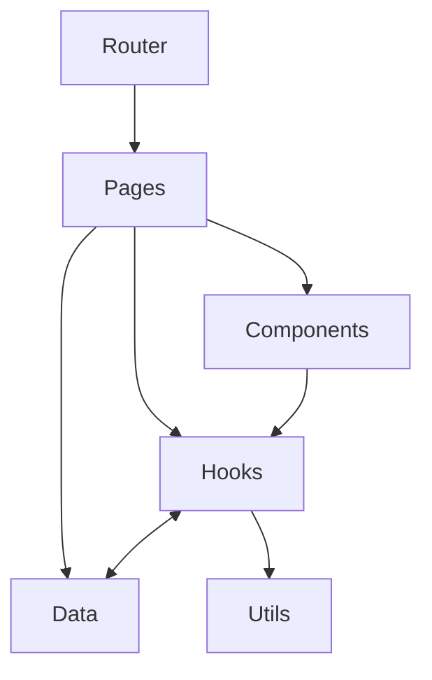
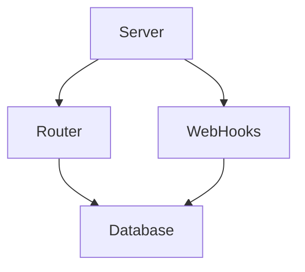

# ChatLite 

This is my web chat application. I have to admit that it turned out to be more complex than I initially thought.

## Installing

To build the application just run:

    ./build.sh

and to run, execute: 

    node ./server/index.js

## Architecture

### Frontend
The architecture of my project consists of five main layers: Router, Pages, Components, Hooks, and Data, arranged hierarchically. Each layer can consume from those below it.

The Data layer holds the api interaction and the redux state managment.

### Backend
There are only four layers here: Server, Routes, WebHooks, and Database. Similarly, each layer can consume the lower layers.

## Folder structure

### Frontend
My folder structure is based on the type of file it holds. 

    api (contains api logic)
    app (app config for the Redux store)
    components
    context 
    features (here I have the slices and thunks for Redux)
    hooks
    pages 
    utils

Component subfolders are divided according to their function.

### Backend
Here I have 3 main folders, api, db and socket, also I have utils and uploads for functionalities.

## What i've used?

### Frontend
First I decided to use React 'cause it's usefull components and hooks.

Technologies that I used: 

    Vite
    React-Router (for routing)
    Redux + Redux Toolkit (for global state management)
    Tailwind (easier than Vanilla CSS and better than Bootstrap)
    Axios (for the API)
    Socket.IO (simple and strong)
    uuid (Generate unique IDs, better than timestampt IDs)

    emoji-picker-react (https://github.com/ealush/emoji-picker-react) Simple to use and open source.

    I used icons and examples from the web.

### Backend 

My back was made with NodeJS

Technologies: 

    Express 
    Socket.IO
    (Both easy to use and great for small projects like that)

    bcrypt (checking passwords, better security)
    uuid (Generating random IDs)

    Path & multer (Uploading photos to the server)

